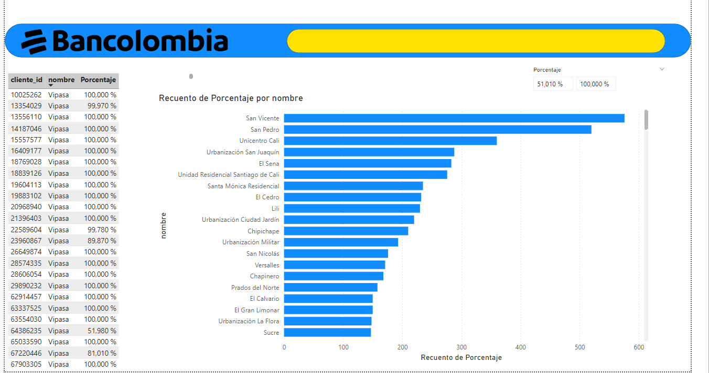

# Solución de Análisis y Reporte Transaccional - Bancolombia


## Descripción

En el contexto de un banco líder como **Bancolombia**, esta solución aborda retos relacionados con el análisis, procesamiento y reporte de datos transaccionales. Utilizando un enfoque híbrido entre Python y SQL, la solución implementada automatiza cálculos clave, genera visualizaciones relevantes en **Power BI** y proporciona respuestas eficientes a problemas planteados en la prueba técnica.

Se procesaron tres datasets principales con información de barrios, dispositivos y transacciones, logrando identificar patrones de uso, clientes y dispositivos clave. Los resultados fueron validados y exportados para su análisis.


## Contexto

El ciclo de vida de los datos fue clave en esta solución, abordando las siguientes etapas:

1. **Generación y adquisición de datos**: Se recibieron tres archivos CSV que representaban datos ficticios sobre barrios, dispositivos y transacciones.
2. **Procesamiento y transformación**: Los datos fueron procesados y transformados utilizando Python y SQL para responder preguntas clave y asegurar la integridad de la información.
3. **Almacenamiento**: Los resultados intermedios y finales se almacenaron en formatos CSV para facilitar la validación y su uso en herramientas externas.
4. **Análisis y visualización**: Los datos procesados se integraron en dashboards de Power BI, destacando insights relevantes.
5. **Distribución y toma de decisiones**: La solución proporciona información lista para la toma de decisiones estratégicas en la gestión de dispositivos y transacciones.

Esta implementación asegura la trazabilidad y reutilización de los datos en diferentes etapas, permitiendo un enfoque eficiente y escalable.

Las organizaciones financieras necesitan herramientas que permitan analizar grandes volúmenes de datos de forma eficiente. En este proyecto:

- **Se analizaron datos de transacciones, ubicaciones y dispositivos**, para responder preguntas específicas sobre los barrios más transaccionales, dispositivos más utilizados y patrones de clientes únicos.
- **Python y SQL** se utilizaron como herramientas principales para garantizar precisión en el procesamiento.
- **Power BI** permitió mostrar visualizaciones claras y comprensibles para apoyar decisiones estratégicas.


## Solución Técnica

### 1. Extracción y Procesamiento de Datos

Los datos fueron extraídos y procesados desde archivos CSV proporcionados, utilizando las siguientes herramientas:

- **Python**: Scripts para realizar cálculos y generar archivos de salida.
- **SQLite**: Motor de base de datos utilizado para ejecutar consultas SQL desde DBeaver.

Los puntos principales procesados fueron:

- **Punto 1:** Identificar los barrios más transaccionales por cliente, aquellos que concentran el 51% del dinero total transaccionado.
  - **Validación de resultados (Python y SQL):**
  
  

- **Punto 2:** Listar dispositivos con transacciones de al menos 100 clientes diferentes.
  - **Validación de resultados (Python y SQL):**
  
  

- **Punto 3:** Determinar los 5 barrios con mayor cantidad de clientes únicos realizando transacciones en dispositivos tipo POS.
  - **Validación de resultados (Python y SQL):**
  
  

### 2. Reporte y Visualización

- **Exportación de resultados:** Los resultados de Python y SQL se exportaron a **CSV** para validación cruzada.
- **Power BI Dashboard:** Se construyeron dashboards para los puntos 1 y 3, resaltando insights clave mediante gráficos y tablas interactivas.

### 3. Actualización Estratégica de Dispositivos

¿Por qué <= 0.60?  
Porque estamos interesados en los barrios necesarios para cubrir hasta el 60% del total, con el objetivo de minimizar la cantidad de barrios visitados. Esto maximiza el impacto (número de dispensadores) y reduce el esfuerzo logístico (menos barrios).

**Resultado esperado:**  
Si hay 15 barrios que contribuyen al 60% del total de dispositivos, esta consulta los identificará, priorizando los que tienen más dispositivos.

Se implementó un análisis de frecuencias que determinó los barrios donde ubicar personal para actualizar dispositivos tipo DISPENSADOR, priorizando aquellos que concentran el 60% del total.

### 4. Gestión de Código con GIT

El código fue documentado y preparado para ser gestionado en un repositorio remoto en **Azure**, siguiendo los pasos estándar para versionamiento.


## Instalación y Requisitos

### Requisitos Previos

- **Python 3.x**: [https://www.python.org/downloads/](https://www.python.org/downloads/)
- **SQLite y DBeaver**: Herramientas para trabajar con bases de datos y ejecutar consultas SQL.
- **Power BI**: Para visualización de datos.

### Dependencias en Python

Instala las dependencias necesarias ejecutando:

```bash
pip install pandas
```


## Estructura del Proyecto

```bash
├── Instrucciones/                  # Instrucciones de la prueba técnica.
├── Media/                          # Imágenes y validaciones de la solución.
├── PowerBI/                        # Dashboards y visualizaciones realizadas en Power BI.
├── Python & DB/                    # Scripts de Python y archivos CSV utilizados como insumos.
├── Resultados/                     # Archivos de resultados generados tras el procesamiento.
├── Scripts SQL/                    # Scripts SQL utilizados para resolver los puntos.
├── bancolombia_db/                 # Base de datos SQLite.
├── README.md                       # Archivo de documentación del proyecto.
├── Componente GIT & Preguntas.pdf  # Documento con los pasos de Git y las preguntas abiertas.
├── Solución_comprimida.zip         # Carpeta comprimida con todos los archivos entregados.
```


## Diccionario de Datos

**Archivo 1 (trx_clientes):**  
- `registro`: Identificador único del cliente.  
- `tipo_doc`: Tipo de documento del cliente.  
- `canal`: Canal utilizado para la transacción (e.g., POS, cajeros).  
- `cod_dispositivo`: Código del dispositivo donde se realizó la transacción.  
- `num_trx`: Número de transacciones realizadas.  
- `mnt_total_trx`: Monto total transaccionado por el cliente.  

**Archivo 2 (ubicación_dispositivos):**  
- `tipo`: Tipo de dispositivo (e.g., POS, cajeros, corresponsales).  
- `codigo`: Identificador único del dispositivo.  
- `latitud`: Coordenada de latitud del dispositivo.  
- `longitud`: Coordenada de longitud del dispositivo.  
- `id_barrio`: Identificador único del barrio asociado al dispositivo.  

**Archivo 3 (barrios):**  
- `codigo`: Identificador único del barrio.  
- `nombre`: Nombre del barrio asociado al código.  

## Análisis y Visualización

Los datos procesados se integraron en un dashboard de Power BI, destacando insights relevantes.

### Punto 1: Barrios más transaccionales por cliente
**Gráfico:** Distribución por cliente en barrios clave.  


### Punto 3: Análisis de dispositivos DISPENSADOR
**Gráfico:** Priorización de barrios para actualización.  


## Conclusión

Esta solución demuestra un enfoque integral para el análisis y reporte de datos en un entorno financiero. Al implementar el ciclo de vida completo de los datos, desde la adquisición hasta la visualización, se logra:

- Automatizar procesos complejos de análisis y cálculo, minimizando errores humanos.
- Proporcionar insights clave que facilitan la toma de decisiones estratégicas, como la priorización de barrios para la actualización de dispositivos.
- Integrar herramientas como Python, SQL y Power BI para garantizar precisión, escalabilidad y claridad en los resultados.

El uso de dashboards interactivos en Power BI resalta la capacidad de esta solución para convertir datos en información valiosa. Además, el enfoque en eficiencia y simplicidad logística, como el criterio del 60% para los dispositivos DISPENSADOR, asegura un uso óptimo de los recursos.
